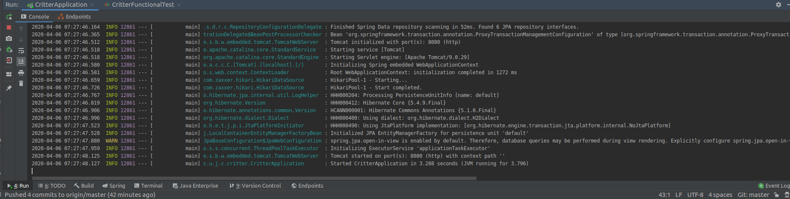
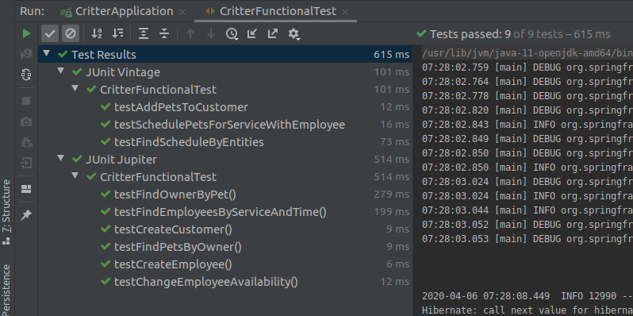
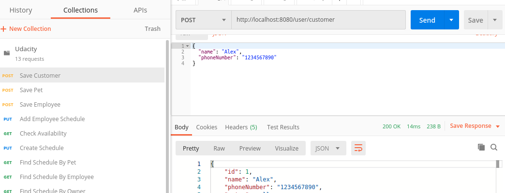
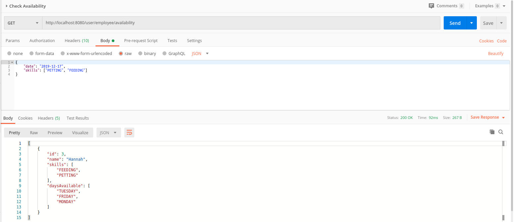
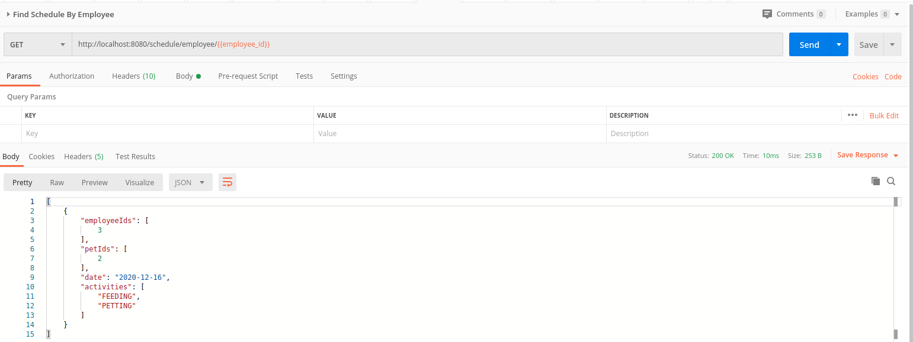
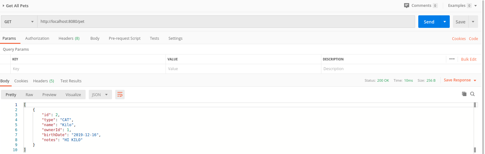

# Pet Shop

This is a pet service app. This is a project I build in Java using Spring boot technologies. This project is intended to help a shop manage their customer's pet and the employees in charge.

Below is a screen shot to show that the App builds successfully and is accessible on localhost:8080 on my local computer(Ubuntu 18.04.3 LTS)

The test that was provided in this project all passes successfully, below we have added a screen shot to show the successful running of the tests provided in this project;

### Postman Collections

Also in this project was include a postman collection with request that all returned **`200 ok`**. In all we had 13 postman request provided but since we didn't want to crowd the `README` file with 13 screenshots we choose to show 4 of them here.
Below I included 4 major request and their results we had when we send some postman requests.

#### Save Customer

#### Checking For Availability

#### Find Schedule by Employee

#### Get All Pets

